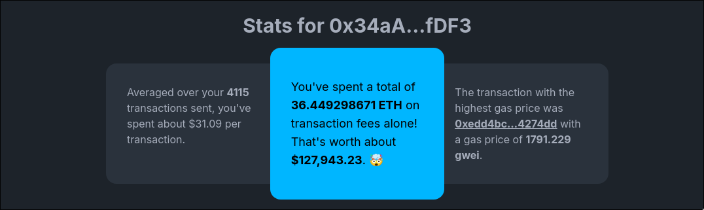
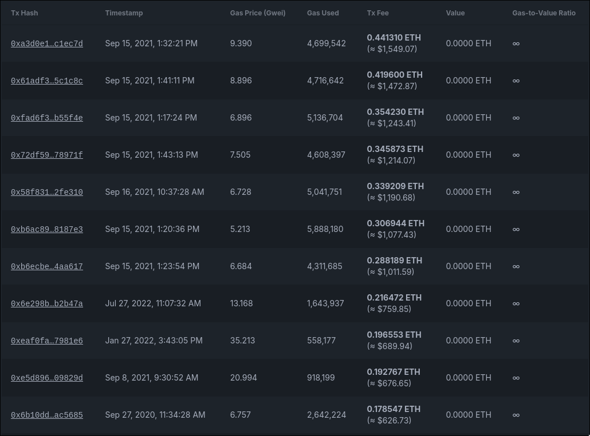

# Gas Stats

This is a simple web tool that aggregates the amount of gas used for all time.

## Screenshots

> Stats at a glance
> 

> Transactions by tx fee
> 

## Getting Started

First, clone the repository:

```bash
git clone https://github.com/ByteAtATime/gas-stats-v2.git
```

Then, install the dependencies:

```bash
cd gas-stats-v2
pnpm install
```

Finally, start the development server:

```bash
pnpm dev
```

The app should now be running at [http://localhost:5173](http://localhost:5173).

You can also run integration tests, which are written using [Playwright](https://playwright.dev/):

```bash
pnpm test:integration
```
